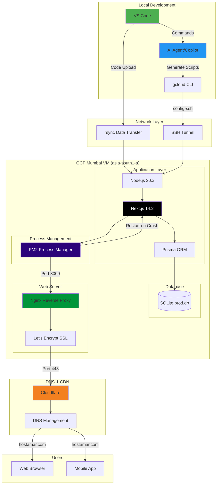
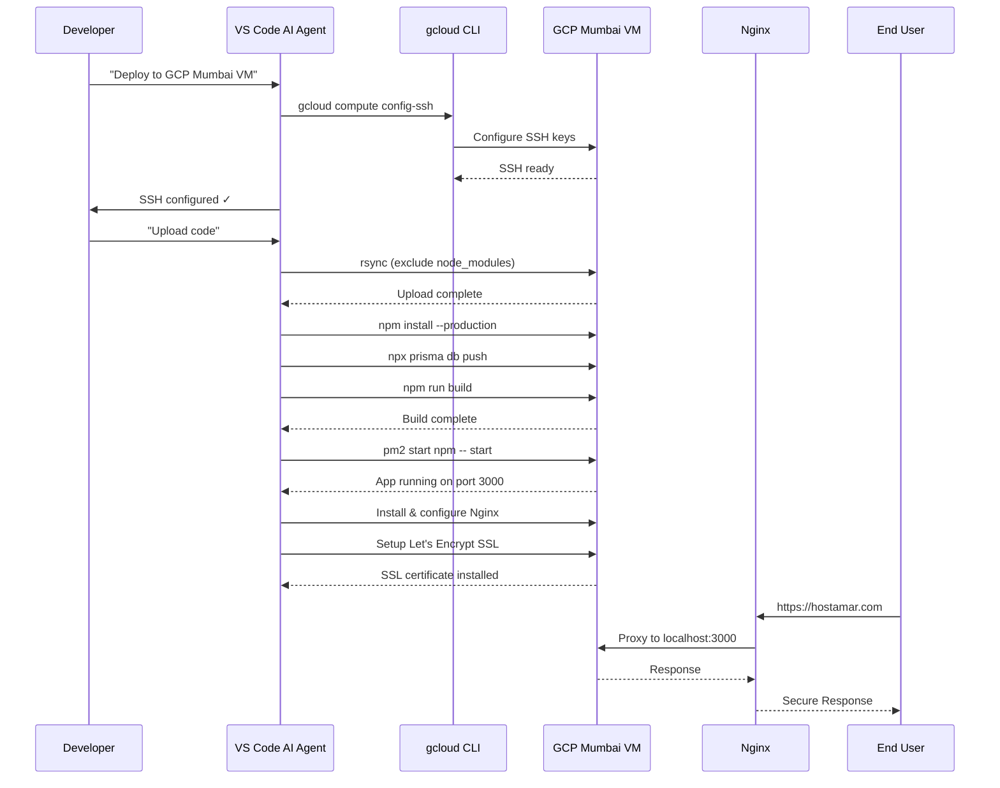
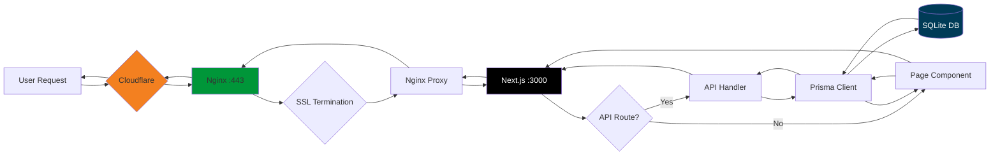
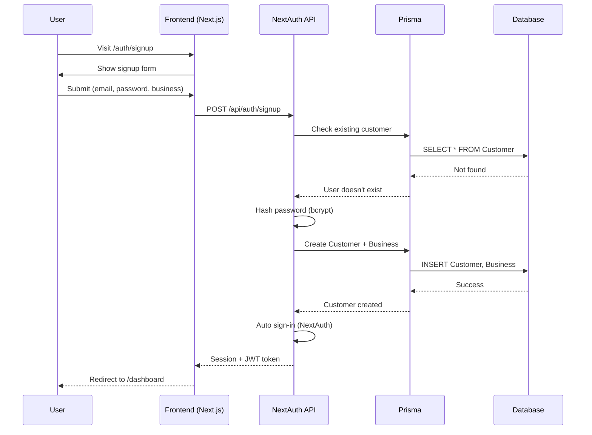
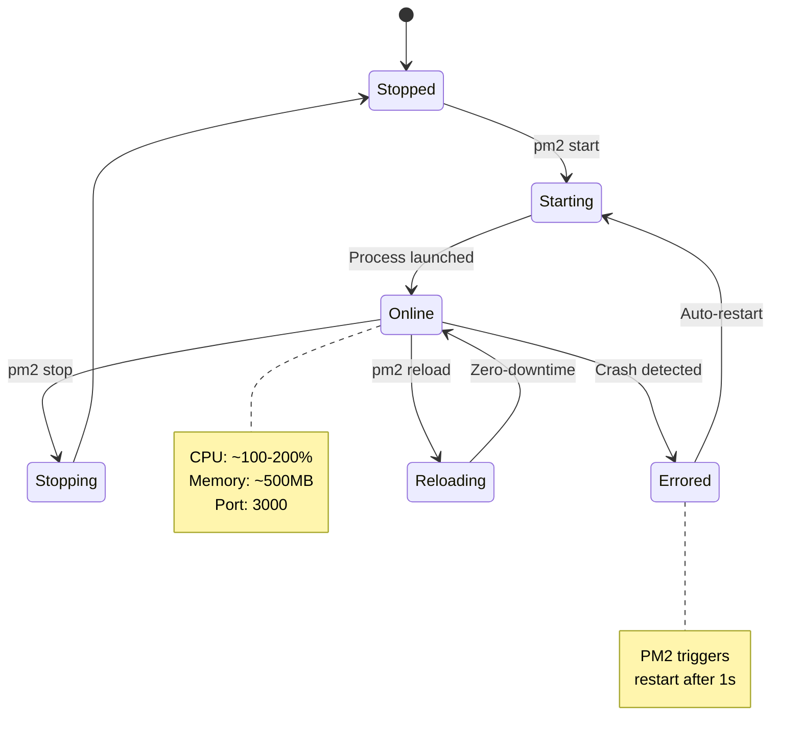
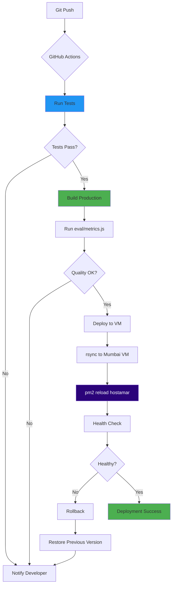
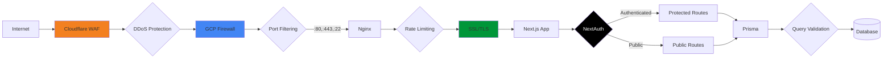
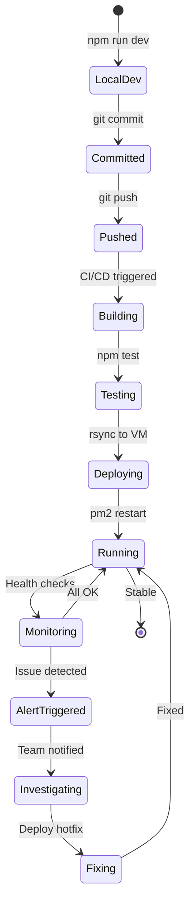

# Hostamar Platform - Deployment Architecture

## Complete System Diagram



## Deployment Flow



## Data Flow



## Authentication Flow



## PM2 Process Lifecycle



## CI/CD Pipeline (Future)



## Monitoring & Alerting (Future)

```mermaid
graph TB
    subgraph "Application Metrics"
        HEALTH[/api/health]
        PM2M[PM2 Metrics]
        LOGS[Application Logs]
    end
    
    subgraph "System Metrics"
        CPU[CPU Usage]
        MEM[Memory Usage]
        DISK[Disk Space]
        NET[Network Traffic]
    end
    
    subgraph "Monitoring Stack"
        PROM[Prometheus]
        GRAF[Grafana]
    end
    
    subgraph "Alerting"
        SLACK[Slack Webhook]
        EMAIL[Email Alerts]
    end
    
    HEALTH --> PROM
    PM2M --> PROM
    LOGS --> PROM
    CPU --> PROM
    MEM --> PROM
    DISK --> PROM
    NET --> PROM
    
    PROM --> GRAF
    GRAF --> SLACK
    GRAF --> EMAIL
    
    style PROM fill:#E6522C
    style GRAF fill:#F46800
```

## Security Layers



## Deployment States



---

## Legend

- **Green boxes**: Development/Success states
- **Blue boxes**: Processing/Active states
- **Purple boxes**: Process managers
- **Orange boxes**: CDN/Proxy layers
- **Black boxes**: Core application
- **Red/Orange boxes**: Monitoring/Alerting

---

*Generated for Hostamar Platform Deployment*  
*Last Updated: November 29, 2025*
