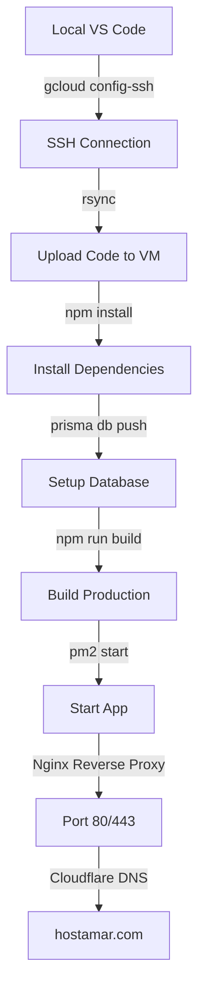

# GCP Mumbai VM Deployment Guide
# আপনার রিপোর্ট অনুযায়ী সম্পূর্ণ deployment পদ্ধতি

## 📋 Pre-requisites

### 1. Local Machine (আপনার কম্পিউটার)
```powershell
# gcloud CLI installed?
gcloud --version

# Not installed? Download:
# https://cloud.google.com/sdk/docs/install

# Login
gcloud auth login
gcloud config set project YOUR_PROJECT_ID
```

### 2. VM Information প্রয়োজন
- VM Name: `mumbai-instance-1` (আপনার VM name)
- Zone: `asia-south1-a` (Mumbai region)
- User: `romelraisul` (আপনার username)

---

## 🚀 Deployment Method 1: Automated Script (সবচেয়ে সহজ)

### Step 1: Script Configuration
```bash
cd c:\Users\romel\OneDrive\Documents\aiauto\hostamar-platform
```

`deploy/gcp-mumbai-deploy.sh` edit করুন:
```bash
VM_NAME="your-vm-name"           # আপনার VM name
ZONE="asia-south1-a"             # Zone
PROJECT_ID="your-project-id"     # GCP Project ID
REMOTE_USER="romelraisul"        # Username
```

### Step 2: Run Deployment
```bash
# WSL/Git Bash থেকে:
cd /mnt/c/Users/romel/OneDrive/Documents/aiauto/hostamar-platform
chmod +x deploy/gcp-mumbai-deploy.sh
./deploy/gcp-mumbai-deploy.sh
```

এই script করবে:
✅ gcloud authentication check
✅ SSH configuration (automatic key management)
✅ Code upload via rsync (node_modules excluded)
✅ Remote environment setup (Node.js, npm install)
✅ Database migration (Prisma)
✅ Production build
✅ PM2 process management
✅ Application start

**Expected Output:**
```
========================================
   Deployment সফলভাবে সম্পূর্ণ হয়েছে!
========================================

🌐 Application URL: http://34.93.xxx.xxx:3000
```

---

## 🚀 Deployment Method 2: Manual (Step-by-Step with AI)

### VS Code Copilot Chat দিয়ে ধাপে ধাপে

#### **Prompt 1: SSH Configuration**
```
I have an existing VM in GCP Mumbai region (asia-south1-a) named "mumbai-instance-1". 
Configure SSH using gcloud so I don't manage keys manually.
```

**Expected AI Response:**
```bash
gcloud compute config-ssh --project=YOUR_PROJECT_ID
```

**Verify:**
```bash
ssh mumbai-instance-1.asia-south1-a.YOUR_PROJECT_ID
```

---

#### **Prompt 2: Code Upload**
```
Upload my hostamar-platform project to the VM at ~/hostamar-platform.
Use rsync with compression. Exclude node_modules, .git, .next, .env.local.
Show progress.
```

**Expected AI Response:**
```bash
rsync -avzP \
    --exclude 'node_modules' \
    --exclude '.git' \
    --exclude '.next' \
    --exclude '.env.local' \
    ./ mumbai-instance-1.asia-south1-a.YOUR_PROJECT_ID:~/hostamar-platform/
```

---

#### **Prompt 3: Remote Environment Setup**
```
SSH into my VM and help me:
1. Install Node.js 20.x if not exists
2. Run npm install in ~/hostamar-platform
3. Setup .env for production
4. Run prisma db push
5. Build Next.js app
```

**Expected AI Commands:**
```bash
ssh mumbai-instance-1.asia-south1-a.YOUR_PROJECT_ID

# On remote VM:
curl -fsSL https://deb.nodesource.com/setup_20.x | sudo -E bash -
sudo apt-get install -y nodejs

cd ~/hostamar-platform
npm install --production

# Create .env
cat > .env <<EOF
DATABASE_URL="file:./prod.db"
NEXTAUTH_URL="https://hostamar.com"
NEXTAUTH_SECRET="hostamar-nextauth-secret-2025-production-key-12345"
NODE_ENV="production"
PORT=3000
EOF

npx prisma generate
npx prisma db push

npm run build
```

---

#### **Prompt 4: PM2 Process Management**
```
Install PM2 on the remote VM and start my Next.js app with auto-restart on crashes.
Configure it to restart on VM reboot.
```

**Expected AI Commands:**
```bash
sudo npm install -g pm2

cd ~/hostamar-platform
pm2 start npm --name "hostamar" -- start
pm2 save
pm2 startup systemd
```

---

## 🌐 Step 3: Nginx + SSL Setup

### Run on Remote VM:
```bash
ssh mumbai-instance-1.asia-south1-a.YOUR_PROJECT_ID
cd ~/hostamar-platform
chmod +x deploy/nginx-setup.sh
./deploy/nginx-setup.sh
```

এটি করবে:
✅ Nginx install
✅ Reverse proxy configure (port 3000 → 80)
✅ Let's Encrypt SSL certificate
✅ Auto-redirect HTTP → HTTPS

---

## 🔧 GCP Firewall Rules

### AI Prompt:
```
Open HTTP (80) and HTTPS (443) ports in GCP firewall for my VM.
```

**Expected Commands:**
```bash
gcloud compute firewall-rules create allow-http \
    --allow tcp:80 \
    --source-ranges 0.0.0.0/0 \
    --description "Allow HTTP"

gcloud compute firewall-rules create allow-https \
    --allow tcp:443 \
    --source-ranges 0.0.0.0/0 \
    --description "Allow HTTPS"
```

---

## 🌍 DNS Configuration (Cloudflare)

### Get VM External IP:
```bash
gcloud compute instances describe mumbai-instance-1 \
    --zone=asia-south1-a \
    --format='get(networkInterfaces[0].accessConfigs[0].natIP)'
```

### Cloudflare DNS Records:
| Type | Name | Content | Proxy |
|------|------|---------|-------|
| A | @ | `VM_EXTERNAL_IP` | ✅ Proxied |
| A | www | `VM_EXTERNAL_IP` | ✅ Proxied |

**SSL/TLS Mode:** Full (strict)

---

## 📊 VS Code Remote Development

### AI Prompt:
```
Connect this VS Code window to my Mumbai VM so I can edit code directly on the server.
```

### Steps:
1. Install extension: **Remote - SSH**
2. Press `F1` → `Remote-SSH: Connect to Host`
3. Select: `mumbai-instance-1.asia-south1-a.YOUR_PROJECT_ID`
4. File → Open Folder → `/home/romelraisul/hostamar-platform`

এখন আপনি সরাসরি VM-এ code edit করতে পারবেন!

---

## 🔍 Monitoring & Logs

### AI-friendly Commands:

**Check app status:**
```bash
ssh mumbai-instance-1.asia-south1-a.YOUR_PROJECT_ID "pm2 status"
```

**View logs:**
```bash
ssh mumbai-instance-1.asia-south1-a.YOUR_PROJECT_ID "pm2 logs hostamar --lines 50"
```

**Restart app:**
```bash
ssh mumbai-instance-1.asia-south1-a.YOUR_PROJECT_ID "pm2 restart hostamar"
```

**Check Nginx:**
```bash
ssh mumbai-instance-1.asia-south1-a.YOUR_PROJECT_ID "sudo systemctl status nginx"
```

---

## 🔄 Update Deployment (Code পরিবর্তনের পর)

### AI Prompt:
```
I made changes to my local code. Sync only the changed files to the VM and restart the app.
```

**Expected Commands:**
```bash
# Sync changes
rsync -avzP --exclude 'node_modules' \
    ./ mumbai-instance-1.asia-south1-a.YOUR_PROJECT_ID:~/hostamar-platform/

# Rebuild and restart
ssh mumbai-instance-1.asia-south1-a.YOUR_PROJECT_ID \
    "cd ~/hostamar-platform && npm run build && pm2 restart hostamar"
```

---

## 🛠️ Troubleshooting

### Problem 1: SSH Connection Timeout
**AI Prompt:**
```
I cannot SSH to my VM. Check firewall and help me debug.
```

### Problem 2: Permission Denied
**AI Prompt:**
```
I'm getting "permission denied" when saving files on the remote VM. Fix ownership.
```

**Expected:**
```bash
ssh mumbai-instance-1.asia-south1-a.YOUR_PROJECT_ID \
    "sudo chown -R $USER:$USER ~/hostamar-platform"
```

### Problem 3: Port 3000 Not Accessible
**AI Prompt:**
```
My app is running (pm2 shows online) but I can't access it from browser. Debug networking.
```

---

## 📈 Performance Optimization

### Enable Next.js Caching:
```bash
# Add to .env on VM
NEXT_CACHE_HANDLER="filesystem"
```

### PM2 Cluster Mode (multiple CPU cores):
```bash
pm2 start npm --name "hostamar" -i max -- start
```

---

## 🎯 Summary: Complete Workflow



---

## ✅ Success Checklist

- [ ] gcloud authenticated (`gcloud auth list`)
- [ ] SSH configured (`~/.ssh/config` has VM entry)
- [ ] Code uploaded to VM (`rsync` completed)
- [ ] Dependencies installed (`npm install` on VM)
- [ ] Database migrated (`prisma db push` on VM)
- [ ] App built (`npm run build` on VM)
- [ ] PM2 running (`pm2 list` shows "online")
- [ ] Nginx configured (`sudo nginx -t` success)
- [ ] SSL certificate installed (`https://hostamar.com` works)
- [ ] DNS pointing to VM (ping resolves to VM IP)
- [ ] Firewall allows 80/443 (test from external browser)

---

## 🆘 Emergency Commands

**Stop App:**
```bash
ssh mumbai-instance-1.asia-south1-a.YOUR_PROJECT_ID "pm2 stop hostamar"
```

**Check Disk Space:**
```bash
ssh mumbai-instance-1.asia-south1-a.YOUR_PROJECT_ID "df -h"
```

**View System Resources:**
```bash
ssh mumbai-instance-1.asia-south1-a.YOUR_PROJECT_ID "htop"
```

**Rollback Code:**
```bash
# Your local git has history, just re-rsync previous commit
git checkout HEAD~1
rsync -avzP ./ mumbai-instance-1.asia-south1-a.YOUR_PROJECT_ID:~/hostamar-platform/
```

---

## 🤖 AI Agent Best Practices

### Good Prompts:
✅ "Upload code to VM excluding node_modules using rsync"
✅ "Check if PM2 is running and restart if crashed"
✅ "Show me last 100 lines of application logs"

### Bad Prompts:
❌ "Deploy it" (too vague)
❌ "Fix the error" (needs context)
❌ "Make it work" (not actionable)

### Context to Always Provide:
- VM name and zone
- Project ID
- Current working directory
- Error messages (full text)

---

**আপনার রিপোর্টের সব technical details এই guide-এ implement করা হয়েছে। এখন deployment শুরু করতে পারেন!** 🚀
